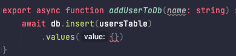
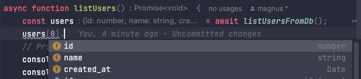

### Initialize the project

First of all, let's initialize our repo

```bash
mkdir drizzle-planetscale-example
cd drizzle-planetscale-example
npm init -y
npm install typescript ts-node @types/node
npx tsc --init
```

### Code

Next we create a basic cli application

2. Create **index.ts**

```ts
function usage() {
    console.log("Usage:");
    console.log("  users-db-cli.ts --list       - fetch all users");
    console.log("  users-db-cli.ts --add <name> - add a user");
    process.exit(1);
}

async function main() {
    if (process.argv.length < 3) {
        usage();
    }

    const flag = process.argv[2];
    const value = process.argv[3];

    if (flag === "--add" && value) {
        await addUser(value);
    } else if (flag === "--list") {
        await listUsers();
    } else {
        usage();
    }
}

async function listUsers() {
    console.log('List users')
}

async function addUser(name: string) {
    console.log('Add user', name)
}


main()
    .then(() => {
        console.log("Success!")
    })
    .catch(err => {
        console.log("Error", err)
    })
```

#### Test run

```
> npx ts-node index.ts --add magnus

Add user magnus
Success!
```

### Setup Planetscale

* First, install the planetscale database driver

```
npm install @planetscale/database
```

* Go to https://app.planetscale.com/ and sign up.
* Follow the instructions to initialize the planetscale CLI and connect to your database.
* Now we can connect to our database **(magnusscale)** and create to our table

```
> pscale shell magnusscale main
magnusscale/main>
```

Create our users table

```mysql
CREATE TABLE
    users
(
    id         INT UNSIGNED AUTO_INCREMENT PRIMARY KEY,
    name       VARCHAR(255) NOT NULL,
    created_at TIMESTAMP DEFAULT CURRENT_TIMESTAMP
);
```

Done!

### Setup drizzle-orm

1. Install drizzle-orm and the mysql2 driver

```
npm i drizzle-orm mysql2
```

2. Create **schema.ts**

```ts
import {int, mysqlTable, text, timestamp} from "drizzle-orm/mysql-core";

export const usersTable = mysqlTable('users', {
    id: int('id').autoincrement().primaryKey(),
    name: text('name').notNull(),
    created_at: timestamp('created_at').notNull().defaultNow(),
});
```

3. Create **db.ts**

```ts
import {connect} from "@planetscale/database";
import {usersTable} from "./schema";
import {drizzle} from "drizzle-orm/planetscale-serverless";

const connection = connect({
    host: "aws.connect.psdb.cloud",
    username: process.env.PLANETSCALE_USERNAME,
    password: process.env.PLANETSCALE_PASSWORD,
});
export const db = drizzle(connection);

export async function addUserToDb(name: string) {
    await db.insert(usersTable)
        .values({name})
}

export async function listUsersFromDb() {
    return db
        .select()
        .from(usersTable)
}
```

4. Get the planetscale credentials and store somewhere. I use `direnv` and an `.env` file

```
PLANETSCALE_USERNAME=cgiyexqws13g...
PLANETSCALE_PASSWORD=pscale_pw_2R...
```

### Update users-cli

Now we can import and use the db functions in *users-cli.ts*.

```ts
import {addUserToDb, listUsersFromDb} from "./db";

function usage() {
    console.log("Usage:");
    console.log("  users-db-cli.ts --list       - fetch all users");
    console.log("  users-db-cli.ts --add <name> - add a user");
    process.exit(1);
}

async function main() {
    if (process.argv.length < 3) {
        usage();
    }

    const flag = process.argv[2];
    const value = process.argv[3];

    if (flag === "--add" && value) {
        await addUser(value);
    } else if (flag === "--list") {
        await listUsers();
    } else {
        usage();
    }
}


const padding = 10

async function listUsers() {
    const users = await listUsersFromDb();

    // Print users
    console.log('ID'.padEnd(padding), 'Name')
    for (const u of users) {
        const paddedId = u.id.toString().padEnd(padding)
        console.log(paddedId, u.name)
    }
}

async function addUser(name: string) {
    await addUserToDb(name)
    console.log(`Added user ${name}!`)
}


main()
    .then(() => {
        console.log("Success!")
    })
    .catch(err => {
        console.log("Error", err)
    })
```

### Typesafety!

What is really cool here, is that we get typesafety for free. Two examples:


*If we try to add a user without a name, we get a compile error.*


*The type returned from `listUsersFromDb()` is also typed!*

### Configure ts-node and ts

Finally, we need to configure `ts-node` and ts correctly so that we can run the CLI. I use the following tsconfig.json
and ts-node.json to make it work with esm and node resolution. **Note:** I spent about 2 hours trying to get this to
work. 🥴

```json
{
  "ts-node": {
    "esm": true,
    "experimentalSpecifierResolution": "node"
  },
  "compilerOptions": {
    "target": "es2016",
    "module": "ESNext",
    "moduleResolution": "node",
    "esModuleInterop": true,
    "forceConsistentCasingInFileNames": true,
    "strict": true,
    "skipLibCheck": true
  }
}
```

## Using the CLI

Let's add some users...

```
> npx ts-node index.ts --add magnus
> npx ts-node index.ts --add eve
```

...and list them

``` 
> npx ts-node index.ts --list
ID        Name
-----      -----
1         magnus
2         eve
```

Cool stuff! 🎉

## Conclusion

1. Drizzle-orm is awesome! It's so easy to use and it's typesafe!
2. Planetscale is also great. Super smooth onboarding and easy to use. 
3. Configure ts-node and ts correctly with ESM modules is hell 😅

### G'bye!